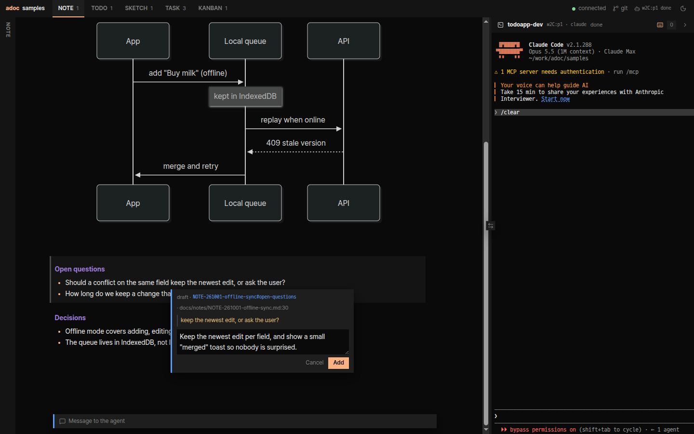
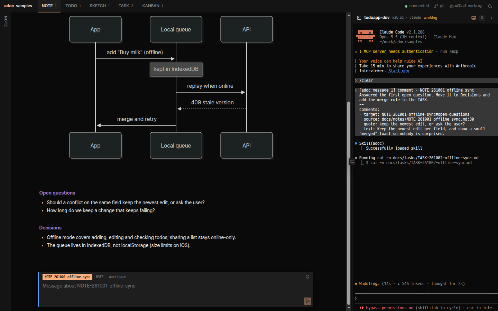
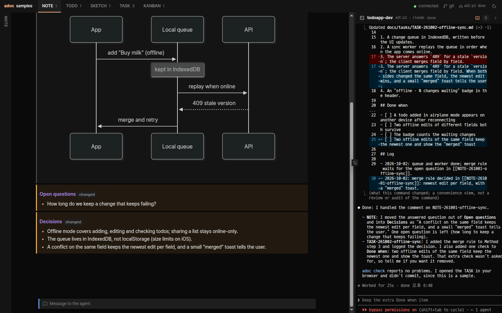
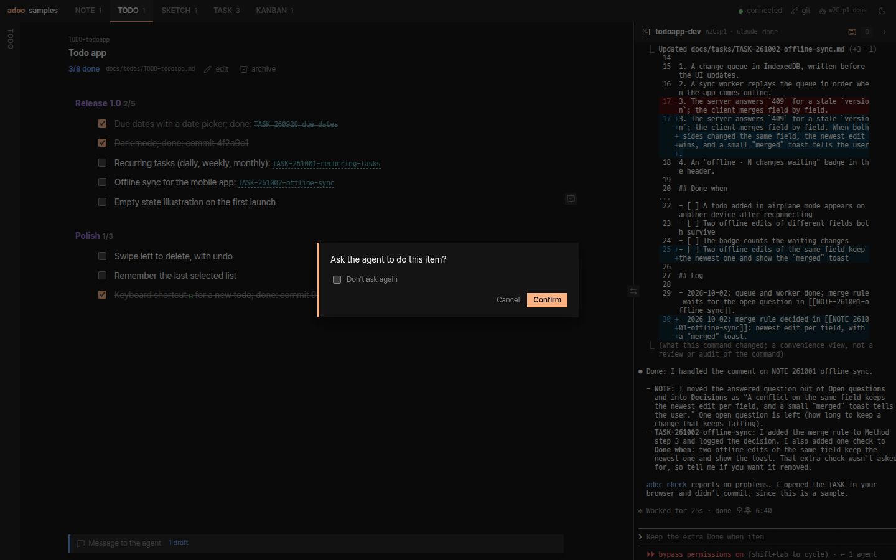
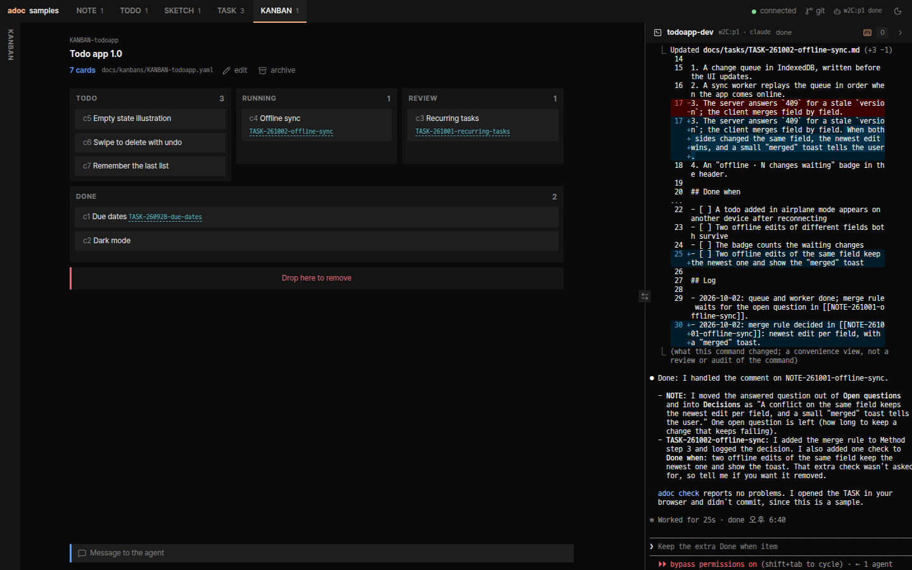
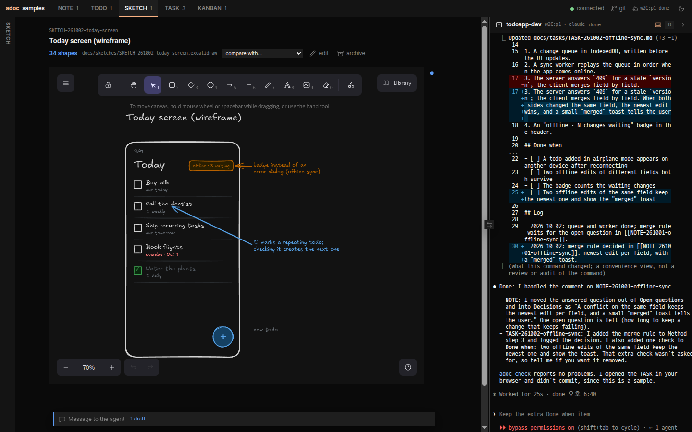

# adoc

adoc is a place where you and a coding agent work on documents together. The documents are plain files in your
repository, such as notes, TODO lists, task work orders, boards and drawings, and each kind comes from a **plugin**.

- **The agent edits the files** with the `adoc` command line or its MCP tool, and commits them.
- **You read them rendered in a web UI**, comment on a section or on selected text, edit them, or press their buttons.
  Each of those reaches the agent as a **message**; in a herdr pane it arrives as a prompt, and the
  web UI shows the agent's terminal beside the documents.

adoc does not depend on one agent: any agent that can run a command or use MCP can work with it.

## How it looks

Select text in a document and comment on it; the comment carries the quote and its `file:line`.



Send it, and it reaches the agent's herdr pane as a prompt. The web UI shows that terminal beside the documents.



When the agent has edited the documents, the web UI marks what changed since you last looked.



Plugins bring their own views and actions: a click on a TODO item asks the agent to do it, a board shows where work
stands, and a sketch shows the agent what you mean.



| KANBAN | SKETCH |
|---|---|
|  |  |

The screenshots come from [`samples/`](samples/), a todo app team's workspace with Claude Code as its agent.

## Requirements

- Node.js 24 or later
- git (recommended: the agent commits every change)
- herdr 0.9.3 or later (recommended), for pushed messages and the terminal in the web UI

## Install

```sh
npm install -g @agent-workshop/adoc
```

This installs the `adoc` command, the web UI and the five plugins of adoc: NOTE (shared notes), TODO (task lists), TASK
(work orders), KANBAN (a board) and SKETCH (drawings).

## Quick start

```sh
cd my-project               # a git repository
adoc init                   # .adoc/adoc.yaml with the five plugins, and docs/
adoc skill install          # teaches your agents adoc and each plugin (agent skills)
adoc server run             # the web UI at http://127.0.0.1:7700
```

Then start your agent in a herdr pane and let it run `adoc agent claim`: your comments and actions in the web UI are
pushed into that pane. Without herdr, set `agent.transport.kind: wait` in `.adoc/adoc.yaml`, and the agent takes its
messages with `adoc message wait`.

The agent learns the rest from its skills: `adoc skill view adoc` shows what it reads.

## Configuration

`.adoc/adoc.yaml` declares which plugins the workspace uses, as `KEY: <source>`, laid over your own
`~/.config/adoc/adoc.yaml`. Paths are relative to the file:

```yaml
plugins:
  NOTE: npm:@agent-workshop/adoc-plugin-note     # an npm package (the five come with adoc)
  TASK: ./plugins/task                           # a folder, here .adoc/plugins/task
  MIND: github:someone/adoc-plugins/mindmap#v1   # fetched by `adoc plugin install`
watch:
  - ../docs
ui:
  tabs: [NOTE, TASK, MIND]
```

A plugin is a folder with `index.ts` and `skill/SKILL.md`; `adoc skill view adoc-plugin-authoring` explains how to write
one.

## Security

The server listens on `127.0.0.1` by default. With `server.host: 0.0.0.0` it accepts the internal network **without
authentication**: anyone who reaches the port can read and edit the documents and control the agent's terminal.

## License

adoc is released under the [Zero-Clause BSD License](LICENSE). The bundled browser code and fonts keep their own
licenses; see [THIRD_PARTY_NOTICES.md](THIRD_PARTY_NOTICES.md). To work on adoc itself, see
[CONTRIBUTING.md](CONTRIBUTING.md).
