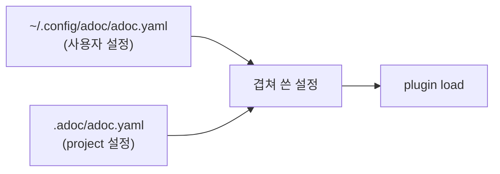

## Background

plugin은 지금 손으로 폴더를 만들거나 복사해서 `.adoc/plugins/`, `~/.config/adoc/plugins/`, 또는 경로로 둡니다. 다른 사람이 만든 plugin을 받거나 새 버전으로 바꿀 방법이 없고, 기본 plugin 다섯 개는 이 저장소에만 있습니다. 첫 release 전에 plugin을 어떻게 배포하고, 설치하고, 설정에서 쓰는지를 한 번에 정합니다.

## What is wrong today

- `from:`의 이름만 쓴 값은 폴더 두 곳을 찾고 없으면 npm으로 넘어가서, `plugins/todo`처럼 `./`를 빠뜨리면 npm에서 찾다가 실패합니다.
- 설정의 경로는 workspace 루트 기준인데, 설정 파일은 `.adoc/` 안에 있습니다.
- 기본 plugin은 배포되지 않고, `adoc init`은 `plugins: []`를 씁니다.
- 탭 순서가 `plugins` 목록 순서에 묶여 있습니다.
- 내 컴퓨터에서 늘 쓰고 싶은 plugin을 workspace마다 선언해야 합니다.
- plugin을 어디서 받았는지 기록이 없어서 업데이트할 수 없고, plugin이 필요한 plugin-kit 버전을 알 수 없습니다.

## Findings

| 제품 | 참고할 점 |
|---|---|
| herdr plugin | `owner/repo/하위폴더` 표기, GitHub 설치는 herdr가 관리하는 폴더에 두고 다시 설치하면 덮어씀, 로컬 `link` 위에는 설치 거부, manifest의 `min_herdr_version` |
| Obsidian | vault마다 `.obsidian/plugins/<id>/`, 설치 목록과 사용 목록이 따로, manifest의 `minAppVersion` |
| Claude Code plugins | 출처(GitHub, git, 경로) 등록, 사용 여부는 user/project/local 설정을 겹쳐서 정함 |
| ESLint flat config, tsconfig | 경로는 설정 파일 기준, plugin은 설정 파일 위치에서 npm으로 찾음 |
| git config, `.npmrc` | 사용자 설정 위에 project 설정을 겹쳐 씀 |
| npm, Deno | `npm:` 표기, `github:owner/repo#ref` |
| Vercel `skills`, lazy.nvim | 출처와 고정한 버전을 lock 파일에 적음 |

공통점은 셋입니다. 출처와 버전을 lock 파일에 적고, 설치하는 곳이 정해져 있고, 배포물은 빌드된 상태입니다.

## Ideas

**설정 (`adoc.yaml`)**

```yaml
plugins:                                   # 무엇을 어떤 key로 쓰는가
  TODO: npm:@agent-workshop/adoc-plugin-todo
  NOTE: ../../plugins/note                 # 디렉터리
  TASK: ./plugins/task                     # 권장 위치 .adoc/plugins/task
  SKETCH: github:user/project/some/folder/sketch#v1.2
  MINDMAP: off                             # 사용자 설정의 plugin을 이 workspace에서 끔
watch:
  - ../docs
ui:
  tabs: [NOTE, TODO, SKETCH, TASK, KANBAN] # 빠진 key는 선언 순서대로 뒤에
```



## Open questions

- (없음)

## Decisions

- 기본 plugin 다섯 개는 각각 npm package `@agent-workshop/adoc-plugin-<name>`로 배포합니다. adoc(CLI)을 설치하면 함께 설치되고, plugin마다 따로 업데이트할 수 있습니다.
- webapp은 `@agent-workshop/adoc-webapp`으로 따로 publish합니다.
- **설치와 사용을 나눕니다.** `plugins`는 `KEY: <출처>`의 map으로 "무엇을 어떤 key로 쓰는가"만 적고, 탭 순서는 `ui.tabs`에 따로 둡니다.
- **출처 표기:** `npm:<package>[@<범위>]`, `github:<owner>/<repo>[/<폴더>][#<ref>]`, 그리고 `./`, `../`, `/`로 시작하는 디렉터리. `off`는 그 key를 끕니다.
- **설정의 모든 상대경로는 그 설정 파일이 있는 폴더 기준입니다.** `watch`도 같아서 project 설정에서는 `../docs`입니다.
- **사용자 설정 `~/.config/adoc/adoc.yaml`을 먼저 읽고, project 설정 `.adoc/adoc.yaml`을 위에 겹칩니다.** key 단위로 project가 이기고, `off`로 끌 수 있습니다. 팀이 함께 쓰는 plugin은 project 설정에 적습니다.
- **`npm:` 출처는 그것을 선언한 설정 파일의 폴더에서 Node 방식으로(위로 올라가며) 찾고, 없으면 adoc 설치본에서 찾습니다.** project는 `.adoc/node_modules`와 `<project>/node_modules`, 사용자는 `~/.config/adoc/node_modules`(`npm i --prefix ~/.config/adoc …`)입니다. project에 설치한 버전이 내장 버전보다 먼저 잡히므로 plugin 하나만 올릴 수 있습니다.
- **`github:` 출처는 그 설정 파일 옆 `plugins/<key 소문자>/`로 받습니다**(project는 `.adoc/plugins/`, 사용자는 `~/.config/adoc/plugins/`). 받은 commit은 그 옆 `plugins-lock.json`에 적습니다. 받으면 바로 동작해야 하고(빌드 결과와 의존성 포함), adoc은 받는 쪽에서 빌드하지 않습니다.
- **받은 폴더는 고치지 않습니다.** 고치려면 다른 폴더로 복사해서 경로로 선언합니다. 업데이트할 때 받은 폴더가 바뀌어 있으면 거부합니다.
- `adoc plugin install`은 선언되었지만 아직 받지 않은 `github:` 출처를 받고, `adoc plugin update [KEY…]`는 다시 받습니다. `npm:` 출처의 설치와 업데이트는 npm으로 합니다. 둘 다 MCP에서는 거부합니다(skill 명령과 같음). (agent의 결정)
- **호환성:** plugin은 `package.json`의 `peerDependencies`에 `@agent-workshop/adoc-plugin-kit` 범위를 적고, adoc은 load할 때 범위를 검사해 맞지 않으면 알기 쉬운 load 오류를 냅니다.
- 이름만 쓰는 출처와 `~/.config/adoc/plugins/`를 찾는 규칙은 없앱니다. 출시 전이라 옛 형식은 지원하지 않고, 옛 형식을 만나면 새 형식을 알려 주는 오류를 냅니다.
- `adoc init`은 기본 plugin 다섯 개를 `npm:`으로 선언하고 `ui.tabs`를 씁니다.
- 여러 파일로 된 plugin의 hot reload는 이번 범위에서 빼고 TODO에 둡니다.
- `.adoc/`(그 안의 `plugins-lock.json`까지)를 commit할지는 사용자가 정합니다. adoc은 관여하지 않습니다.
