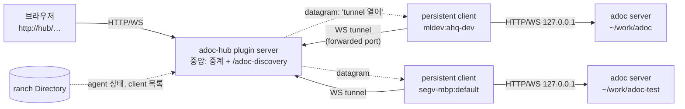

## Background

[[NOTE-261002-workspace-switching]]은 **한 컴퓨터 안**의 여러 adoc을 한 브라우저에서 오가는 안입니다. 그런데 실제로는 adoc이 여러 컴퓨터에 떠 있습니다(mldev의 이 저장소, segv-mbp의 adoc-test 등). herdr-ranch는 이미 이 컴퓨터들의 herdr 세션을 하나로 묶고, 어느 pane에 어떤 agent가 어떤 상태로 있는지(Directory)를 압니다. ranch plugin으로 adoc을 붙이면, ranch가 연결된 **모든 컴퓨터의 모든 adoc**을 한 브라우저에서 보고 처리할 수 있습니다.

## Findings

herdr-ranch plugin의 구조(`herdr-ranch/docs/PLUGINS.md`):

| 부분 | 어디서 | adoc에 쓰면 |
|---|---|---|
| plugin server | 중앙 컴퓨터에 하나 | 모든 adoc 목록을 모으고, 브라우저 입구가 되어 각 adoc으로 중계 |
| persistent client | herdr 세션마다 하나 | 그 컴퓨터의 adoc server 기록(`$XDG_RUNTIME_DIR/adoc/*.json`, macOS는 temp 폴더)을 읽어 보고하고, 중계를 `127.0.0.1`의 adoc server로 이음 |
| Directory | 모든 쪽에서 구독 | 각 adoc의 담당 agent(claim한 pane)의 이름과 상태, 그리고 각 세션의 persistent client 목록 |
| datagram | plugin의 끝점끼리 | 순서 보장, 최대 16 MiB, 저장 안 함, 보낸 쪽은 ranch가 보증 |
| `forward` | plugin server의 port | 각 컴퓨터의 `127.0.0.1:<port>`로 SSH 전달: client가 중앙에 붙는 길 |
| `exposed_ports` | plugin server의 port | LAN/VPN에 공개: 브라우저 입구, 인증은 plugin이 직접 |

- **adoc server는 `127.0.0.1`에 둔 채로 됩니다.** 브라우저는 중앙에만 붙고, 중앙과 각 컴퓨터 사이는 client가 잇기 때문입니다. 지금의 "`0.0.0.0`으로 인증 없이 공개" 문제가 없어집니다.
- **adoc server 기록은 컴퓨터(OS 사용자)마다 하나의 폴더**에 있습니다. 그래서 한 컴퓨터에 herdr 세션이 여럿이면, 모든 세션의 client가 같은 adoc 목록을 봅니다.
- **adoc의 claim은 herdr 세션을 압니다**(`claim.yaml`의 `herdrSession`). 담당 agent가 있는 adoc은 정확히 한 세션에 속합니다.

## Ideas



**1. 주소: 중앙은 각 adoc을 자기 주소 아래에 다시 붙입니다**

```
http://host1/p/NOTE/…              adoc server에 직접 (지금)
http://hub/<host>/p/NOTE/…         같은 화면을 중앙을 거쳐서: <host>의 server로 중계
http://hub/adoc-discovery          떠 있는 adoc 목록과 각 담당 agent의 상태
```

- `<host>`는 workspace 하나를 가리킵니다. 이름을 정하기 전에는 `<machine>_<port>`(예: `mldev_7700`, adoc server의 port)이고, 이름을 정하면 그 이름(예: `adoc`)도 쓸 수 있습니다. 이름을 정한 뒤에도 두 주소 모두 동작합니다.
- 이름은 plugin client의 status 화면에서 사람이 정하거나, 담당 agent가 plugin 명령(예: `adoc-hub name <이름>`, 그 workspace 폴더에서 실행)으로 정합니다. 중앙이 `RANCH_PLUGIN_DATA_DIR`에 (컴퓨터, workspace 경로) → 이름으로 저장하므로, server를 다시 띄워 port가 바뀌어도 이름은 남습니다.
- **화면(html, js)도 API도 그 workspace의 server가 내보냅니다.** 중앙은 그대로 나를 뿐입니다. 그래서 컴퓨터마다 adoc 버전이 달라도 각 화면은 자기 server와 맞습니다. 중앙과 맞춰야 하는 것은 `/adoc-discovery`와 tunnel 규약뿐이라, 중앙에는 adoc web UI 코드가 필요 없습니다. iframe도 필요 없습니다.
- **web UI가 root인지 hub 아래인지 스스로 압니다.** 중앙은 중계하는 요청에 `X-Forwarded-Prefix: /<host>`를 붙이고, adoc server는 index.html에 그 base와 "hub 아래"라는 표시를 넣습니다(지금 theme을 넣는 것과 같은 방식). web UI는 base를 API·WebSocket·asset 주소와 router 기준에 붙이고, hub 아래이면 `/adoc-discovery`를 읽어 host 전환 메뉴를 보여 줍니다. 직접 접속하면 base는 `/`이고 메뉴는 없습니다.
- 한 origin(hub) 아래에서 모든 workspace가 브라우저 저장소를 함께 쓰므로, key를 `adoc.<workspace id>.<이름>`으로 나눕니다.

**2. ranch plugin `adoc-hub` (adoc 저장소의 `ranch-plugin/`)**

- **plugin server(중앙):** `/adoc-discovery`와 `/<host>/…` 중계, 그리고 인증을 맡습니다.
- **persistent client(세션마다):** 시작하면 그 컴퓨터의 adoc server 목록(workspace 경로, url, claim, 버전)을 보고합니다. 중앙이 datagram으로 "tunnel을 열어"라고 하면, `forward`로 받은 `127.0.0.1:<port>`(중앙의 tunnel port)에 WebSocket을 열고, 그 위로 HTTP 요청과 WebSocket을 여러 개 실어 로컬 adoc server와 주고받습니다.
- **datagram은 시작 신호와 목록 보고에만** 씁니다. 데이터는 WebSocket tunnel로만 다닙니다.
- **status 화면:** plugin client는 ranch가 세션마다 열어 두는 plugin pane에 status 화면을 보여 줍니다. 할 수 있는 일은 둘입니다: 연결된 adoc의 이름 정하기, 브라우저 접속 요청 승인 또는 거부. 따로 설정할 것은 없어서 settings 화면은 두지 않습니다.

**3. 한 컴퓨터에 세션이 여럿일 때: 누가 adoc을 맡나**

- plugin client가 plugin server에 연결되면, **server가 그 컴퓨터의 라우팅 담당 client를 하나 지정합니다.** 그 client가 그 컴퓨터의 모든 adoc을 보고하고 중계합니다. client는 서로를 알 필요가 없습니다.
- 담당 client가 끊어지면, 그 컴퓨터에 다른 세션의 client가 있을 때 server가 그쪽으로 라우팅을 다시 지정합니다. 없으면 그 컴퓨터의 adoc은 목록에서 "연결 끊김"으로 보입니다.

**4. 입구와 인증**

- 중앙의 web port를 `exposed_ports`로 LAN에 공개합니다(휴대폰에서도 접속).
- **code 승인:** 처음 접속한 브라우저에는 짧은 code가 보입니다. 같은 code가 모든 plugin client의 status 화면(herdr pane)에 "이 브라우저가 접속하려 합니다"와 함께 뜹니다. 사람이 아무 세션에서든 승인하면 그 브라우저는 오래가는 cookie를 받고, 다른 화면의 요청은 사라집니다. herdr pane에 손이 닿는 사람만 승인할 수 있다는 것이 인증의 근거입니다.

## Open questions

- (없음)

## Decisions

- **브라우저는 중앙(hub)에 접속합니다.** 컴퓨터와 세션을 골라 들어가기 쉽게 하기 위해서입니다.
- **중앙은 각 adoc을 `http://hub/<host>/…` 아래에 다시 붙이고, `http://hub/adoc-discovery`로 목록을 줍니다.** 화면(html, js)과 API는 그 workspace의 server가 내보내므로, 버전이 달라도 됩니다. web UI는 base와 hub 여부를 보고 host 전환 메뉴를 보여 줍니다.
- **데이터는 WebSocket tunnel로 나릅니다.** ranch datagram은 tunnel을 여는 신호(initiation)와 목록 보고에만 씁니다.
- **입구는 LAN에 공개(`exposed_ports`)합니다. 인증은 code 승인입니다:** 브라우저에 보인 code를 아무 plugin client의 status 화면에서 승인하면 끝납니다.
- **plugin client의 화면은 status 하나입니다:** adoc의 이름 정하기와 접속 승인·거부. 설정 화면은 없습니다.
- **`<host>`는 이름을 정하기 전에는 `<machine>_<port>`, 정한 뒤에는 이름이고, 둘 다 쓸 수 있습니다.** 이름은 status 화면에서, 또는 담당 agent가 plugin 명령으로 정합니다.
- **plugin은 우선 adoc 저장소 안(`ranch-plugin/`)에 둡니다.**
- **ranch 판으로 바로 가고, ranch 없는 한 컴퓨터 안 전환([[NOTE-261002-workspace-switching]])은 버립니다.** ranch가 없으면 지금처럼 workspace마다 따로 접속합니다.
- **plugin client가 연결되면 server가 컴퓨터마다 라우팅 담당 client를 하나 지정합니다.** 담당이 끊어지면 그 컴퓨터의 다른 세션 client로 다시 지정합니다.
