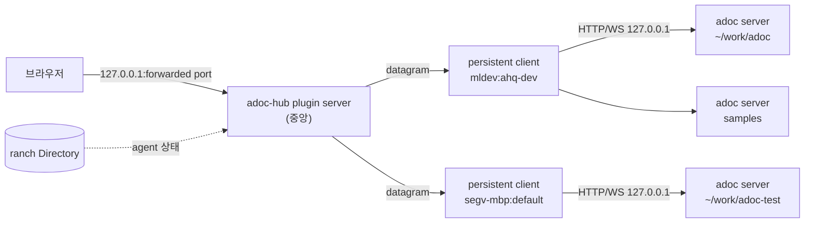

## Background

[[NOTE-261002-workspace-switching]]은 **한 컴퓨터 안**의 여러 adoc을 한 브라우저에서 오가는 안입니다. 그런데 실제로는 adoc이 여러 컴퓨터에 떠 있습니다(mldev의 이 저장소, segv-mbp의 adoc-test 등). herdr-ranch는 이미 이 컴퓨터들의 herdr 세션을 하나로 묶고, 어느 pane에 어떤 agent가 어떤 상태로 있는지(Directory)를 압니다. ranch plugin으로 adoc을 붙이면, ranch가 연결된 **모든 컴퓨터의 모든 adoc**을 한 브라우저에서 보고 처리할 수 있을 것입니다.

## Findings

herdr-ranch plugin의 구조(`herdr-ranch/docs/PLUGINS.md`):

| 부분 | 어디서 | adoc에 쓰면 |
|---|---|---|
| plugin server | 중앙 컴퓨터에 하나 | 모든 adoc 목록을 모으고, 브라우저 입구(web UI)를 제공하고, 각 adoc으로 중계 |
| persistent client | herdr 세션마다 하나 | 그 컴퓨터의 adoc server 기록(`$XDG_RUNTIME_DIR/adoc/*.json`, macOS는 temp 폴더)을 읽어 보고하고, 중계받은 요청을 `127.0.0.1`의 adoc server로 전달 |
| Directory | 모든 쪽에서 구독 | 각 adoc의 담당 agent(claim한 pane)의 이름, 상태, 대화 |
| datagram | plugin의 끝점끼리 | 순서 보장, 최대 16 MiB, 저장 안 함, 보낸 쪽은 ranch가 보증 |
| `forward` / `exposed_ports` | plugin server의 port | 각 컴퓨터의 `127.0.0.1`로 SSH 전달하거나, LAN/VPN에 공개 |

- **adoc server는 `127.0.0.1`에 둔 채로 됩니다.** 브라우저와 adoc server 사이를 ranch datagram이 잇기 때문에, adoc server를 `0.0.0.0`으로 열 필요가 없습니다. 지금 "인증 없이 공개"되는 문제도 줄어듭니다.
- **담당 agent의 상태는 Directory가 이미 압니다.** adoc의 claim(herdr session과 pane id)을 Directory의 agent(`pane`, `status`, `name`)와 맞추면 상태 동그라미와 이름이 나옵니다.
- **ranch는 이런 안내를 합니다:** agent의 대화는 직접 찾지 말고 Directory에서 얻을 것, 공개 port는 plugin이 스스로 인증할 것, 상태는 `RANCH_PLUGIN_DATA_DIR`에 둘 것.

## Ideas

**1. ranch plugin `adoc-hub`**

- **persistent client(세션마다):** 그 컴퓨터의 adoc server 기록을 주기적으로 읽어 `{workspace 경로, url, 담당 agent pane}` 목록을 plugin server에 보냅니다. plugin server가 보낸 요청(HTTP, WebSocket)을 받아 로컬 adoc server로 넘기고 응답을 돌려줍니다.
- **plugin server(중앙):** 모든 client의 목록을 합칩니다. 브라우저용 web port를 하나 열고, `/w/<machine>/<session>/<workspace id>/…`를 그 workspace의 client로 중계합니다. WebSocket(문서 변경, 터미널)도 같은 방식으로 이어 줍니다.
- **브라우저 입구:** 공개(`exposed_ports`)하지 않고 `forward`로 각 컴퓨터의 `127.0.0.1:<port>`에만 엽니다. 그 컴퓨터에 로그인한 사람만 접속하므로 따로 인증이 필요 없습니다.

**2. adoc 쪽에 필요한 것 (한 컴퓨터 안 전환과 같음)**

- **base path:** web UI가 `/` 대신 `/w/<id>/` 아래에서도 동작해야 합니다. server가 index.html에 base를 넣고, web UI는 API·WebSocket·asset 주소와 router 기준에 그것을 붙입니다.
- **workspace tab bar와 상태 동그라미, 저장소 key 분리(`adoc.<workspace id>.<이름>`), `adoc ui open`으로 tab 전환:** [[NOTE-261002-workspace-switching]]의 Decisions를 그대로 씁니다. 목록과 상태의 출처만 ranch로 바뀝니다.

**3. 한 컴퓨터 안 전환과의 관계**

- 같은 web UI를 쓰고, "떠 있는 adoc 목록"과 "중계"를 누가 하느냐만 다릅니다. 둘을 따로 만들지 않고, ranch가 있으면 ranch(adoc-hub)가, 없으면 입구 adoc server가 같은 주소 규칙(`/w/<id>/…`)으로 중계하게 하면 web UI는 한 가지로 됩니다.

## Open questions

- **중앙 컴퓨터에 adoc이 필요할까요?** plugin server가 web UI의 틀(workspace tab bar)을 직접 내보내려면 adoc web UI 코드가 중앙에 있어야 합니다. 대신 틀까지 각 adoc server에서 받아(처음 고른 workspace의 server) 중계만 하게 하면 중앙에는 adoc이 필요 없습니다.
- **datagram으로 HTTP/WebSocket을 나르는 것이 괜찮을까요?** 터미널 frame처럼 잦은 데이터, 큰 asset(web UI 8 MB, SKETCH client 16 MB)이 지나갑니다. asset은 브라우저 cache로 줄일 수 있지만, ranch 쪽 한계(속도, 16 MiB)는 ranch agent에게 확인해야 합니다.
- **입구를 `forward`(각 컴퓨터의 127.0.0.1)로만 할까요, 아니면 LAN 공개(`exposed_ports`)도 할까요?** 공개하면 휴대폰 등에서도 볼 수 있지만, 인증을 plugin이 직접 만들어야 합니다.
- **이 plugin은 어디에 둘까요?** adoc 저장소 안(`ranch-plugin/`)에 둘지, 따로 저장소를 만들지. ranch plugin은 GitHub release로 배포하고, 중앙용 server는 Linux x86_64 빌드가 필요합니다.
- **한 컴퓨터 안 전환([[NOTE-261002-workspace-switching]])을 먼저 만들까요, 아니면 바로 ranch 판으로 갈까요?** web UI 쪽 작업(base path, tab bar, 저장소 분리)은 같습니다.

## Decisions

- (아직 없음)
