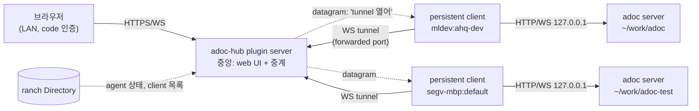

## Background

[[NOTE-261002-workspace-switching]]은 **한 컴퓨터 안**의 여러 adoc을 한 브라우저에서 오가는 안입니다. 그런데 실제로는 adoc이 여러 컴퓨터에 떠 있습니다(mldev의 이 저장소, segv-mbp의 adoc-test 등). herdr-ranch는 이미 이 컴퓨터들의 herdr 세션을 하나로 묶고, 어느 pane에 어떤 agent가 어떤 상태로 있는지(Directory)를 압니다. ranch plugin으로 adoc을 붙이면, ranch가 연결된 **모든 컴퓨터의 모든 adoc**을 한 브라우저에서 보고 처리할 수 있습니다.

## Findings

herdr-ranch plugin의 구조(`herdr-ranch/docs/PLUGINS.md`):

| 부분 | 어디서 | adoc에 쓰면 |
|---|---|---|
| plugin server | 중앙 컴퓨터에 하나 | 모든 adoc 목록을 모으고, 브라우저 입구(web UI)를 내보내고, 각 adoc으로 중계 |
| persistent client | herdr 세션마다 하나 | 그 컴퓨터의 adoc server 기록(`$XDG_RUNTIME_DIR/adoc/*.json`, macOS는 temp 폴더)을 읽어 보고하고, 중계를 `127.0.0.1`의 adoc server로 이음 |
| Directory | 모든 쪽에서 구독 | 각 adoc의 담당 agent(claim한 pane)의 이름과 상태, 그리고 각 세션의 persistent client 목록 |
| datagram | plugin의 끝점끼리 | 순서 보장, 최대 16 MiB, 저장 안 함, 보낸 쪽은 ranch가 보증 |
| `forward` | plugin server의 port | 각 컴퓨터의 `127.0.0.1:<port>`로 SSH 전달: client가 중앙에 붙는 길 |
| `exposed_ports` | plugin server의 port | LAN/VPN에 공개: 브라우저 입구, 인증은 plugin이 직접 |

- **adoc server는 `127.0.0.1`에 둔 채로 됩니다.** 브라우저는 중앙에만 붙고, 중앙과 각 컴퓨터 사이는 client가 잇기 때문입니다. 지금의 "`0.0.0.0`으로 인증 없이 공개" 문제가 없어집니다.
- **adoc server 기록은 컴퓨터(OS 사용자)마다 하나의 폴더**에 있습니다. 그래서 한 컴퓨터에 herdr 세션이 여럿이면, 모든 세션의 client가 같은 adoc 목록을 봅니다.
- **adoc의 claim은 herdr 세션을 압니다**(`claim.yaml`의 `herdrSession`). 담당 agent가 있는 adoc은 정확히 한 세션에 속합니다.

## Ideas

**1. ranch plugin `adoc-hub` (adoc 저장소의 `ranch-plugin/`)**

- **plugin server(중앙):** adoc web UI를 직접 내보냅니다. 브라우저는 중앙에 접속해 workspace tab bar에서 컴퓨터와 세션, workspace를 고릅니다. `/w/<machine>/<session>/<workspace id>/…`의 API와 WebSocket은 그 workspace를 맡은 client의 tunnel로 넘깁니다.
- **persistent client(세션마다):** 시작하면 그 컴퓨터의 adoc server 목록(workspace 경로, url, claim)을 보고합니다. 중앙이 datagram으로 "tunnel을 열어"라고 하면, `forward`로 받은 `127.0.0.1:<port>`(중앙의 tunnel port)에 WebSocket을 열고, 그 위로 HTTP 요청과 WebSocket을 여러 개 실어 로컬 adoc server와 주고받습니다.
- **datagram은 시작 신호와 목록 보고에만** 씁니다. 데이터는 WebSocket tunnel로만 다닙니다.

**2. 한 컴퓨터에 세션이 여럿일 때: 누가 adoc을 맡나**

- 모든 client가 자기 컴퓨터의 adoc 목록 전체를 보고하고, **중앙이 workspace마다 담당 client를 정합니다.** client는 서로를 알 필요가 없습니다.
  - 담당 agent가 있는 workspace는 claim의 herdr 세션과 같은 세션의 client가 맡습니다.
  - 담당 agent가 없거나 그 세션의 client가 없으면, 그 컴퓨터의 client 중 정해진 하나(예: 세션 이름이 가장 앞선 것)가 맡습니다.
  - 그 client가 사라지면 중앙이 다음 client로 바꿉니다(Directory의 client 목록 변화로 앎).

**3. 입구와 인증**

- 중앙의 web port를 `exposed_ports`로 LAN에 공개합니다(휴대폰에서도 접속).
- **code 인증:** 처음 접속한 브라우저에 짧은 code를 입력하라고 합니다. code는 사람이 이미 로그인한 곳(예: 아무 herdr 세션에서 `adoc hub code`, 또는 ranch console)에서 받습니다. 맞으면 그 브라우저에 오래가는 cookie를 주고, code는 한 번 쓰면 버립니다.

**4. adoc 쪽에 필요한 것**

- **base path:** web UI가 `/` 대신 `/w/<id>/` 아래에서도 동작해야 합니다. API·WebSocket·asset 주소와 router 기준에 그것을 붙입니다.
- **workspace tab bar, 상태 동그라미, 저장소 key 분리(`adoc.<workspace id>.<이름>`), `adoc ui open`으로 tab 전환:** [[NOTE-261002-workspace-switching]]의 Decisions를 그대로 씁니다. 목록과 상태의 출처는 중앙(ranch)입니다.
- **plugin과 web UI의 client 코드:** 각 workspace의 plugin client module(`/assets/plugins/<KEY>/`)도 그 workspace의 server에서 받습니다(버전이 workspace마다 다를 수 있음).

## Open questions

- **code 인증의 code는 어디서 받나요?** `adoc hub code` 같은 명령(어느 herdr 세션에서든), ranch console 화면, 또는 중앙 server의 log 중 무엇으로 할까요?
- **web UI의 버전:** 중앙의 web UI와 각 컴퓨터의 adoc server 버전이 다르면, API가 맞지 않을 수 있습니다. 중앙이 각 server의 버전을 보고 맞지 않으면 알려 주는 정도로 할까요?
- **중앙의 adoc 코드는 어떻게 들어가나요?** plugin server를 adoc package(`@agent-workshop/adoc-webapp` 등)에 기대어 빌드할지, ranch plugin release asset에 web UI를 함께 넣을지.
- **한 컴퓨터 안(ranch 없이) 전환은 버릴까요?** ranch가 없는 사람에게는 지금처럼 workspace마다 따로 접속하는 것으로 둘지.

## Decisions

- **web UI는 중앙에서 내보내고, 브라우저는 중앙에 접속합니다.** 컴퓨터와 세션을 골라 들어가기 쉽게 하기 위해서입니다.
- **데이터는 WebSocket tunnel로 나릅니다.** ranch datagram은 tunnel을 여는 신호(initiation)와 목록 보고에만 씁니다.
- **입구는 LAN에 공개(`exposed_ports`)하고, code 방식으로 인증합니다.**
- **plugin은 우선 adoc 저장소 안(`ranch-plugin/`)에 둡니다.**
- **한 컴퓨터 안 전환을 거치지 않고 바로 ranch 판으로 갑니다.**
- 한 컴퓨터에 세션이 여럿이면 중앙이 workspace마다 담당 client를 정합니다: claim의 세션, 없으면 그 컴퓨터의 정해진 client. (agent의 결정, 확인 필요)
