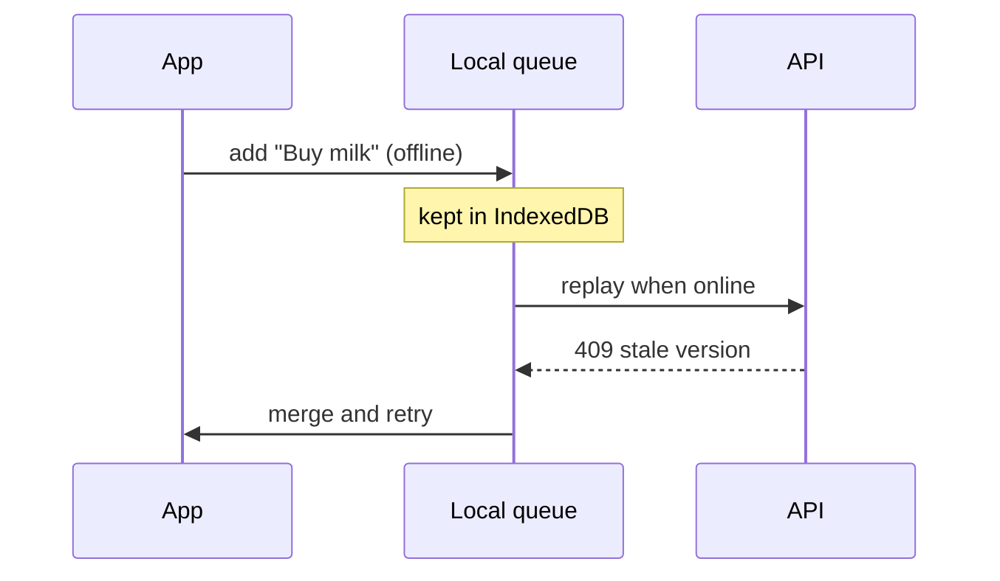

## Background

Users add todos on the subway and lose them when the app cannot reach the server. Support asked for offline mode twice this week.

## Ideas

- Keep every change in a local queue (IndexedDB) and replay it when the network is back.
- Give each todo a `version`; the server rejects a stale write and the client merges.
- Show a small "offline · 3 changes waiting" badge instead of an error dialog.

## Open questions

- How long do we keep a change that keeps failing?

## Decisions

- Offline mode covers adding, editing and checking todos; sharing a list stays online-only.
- The queue lives in IndexedDB, not localStorage (size limits on iOS).
- A conflict on the same field keeps the newest edit per field, and a small "merged" toast tells the user.
